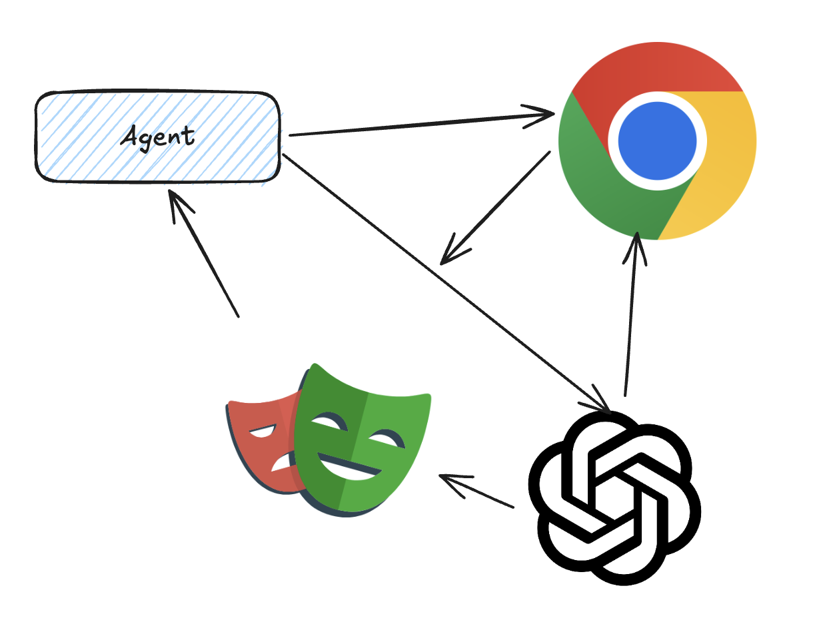
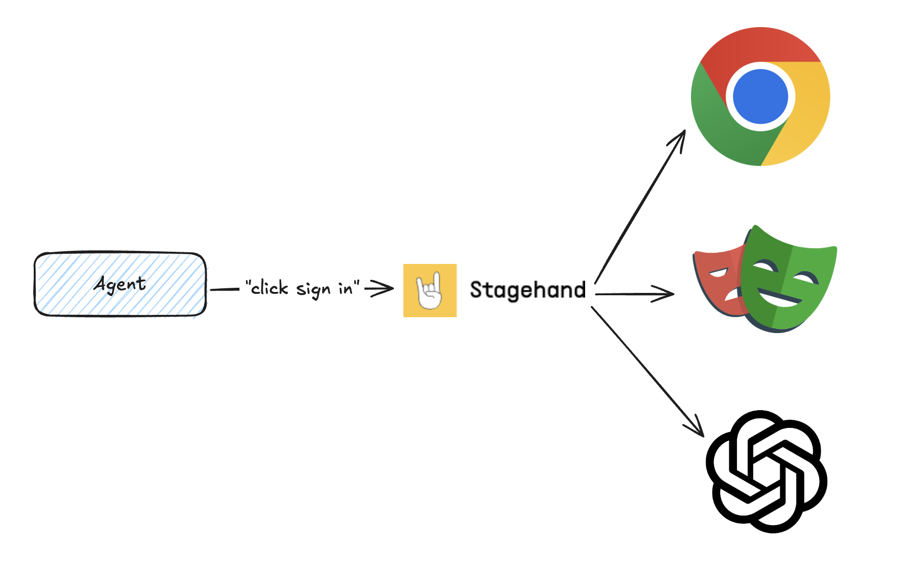
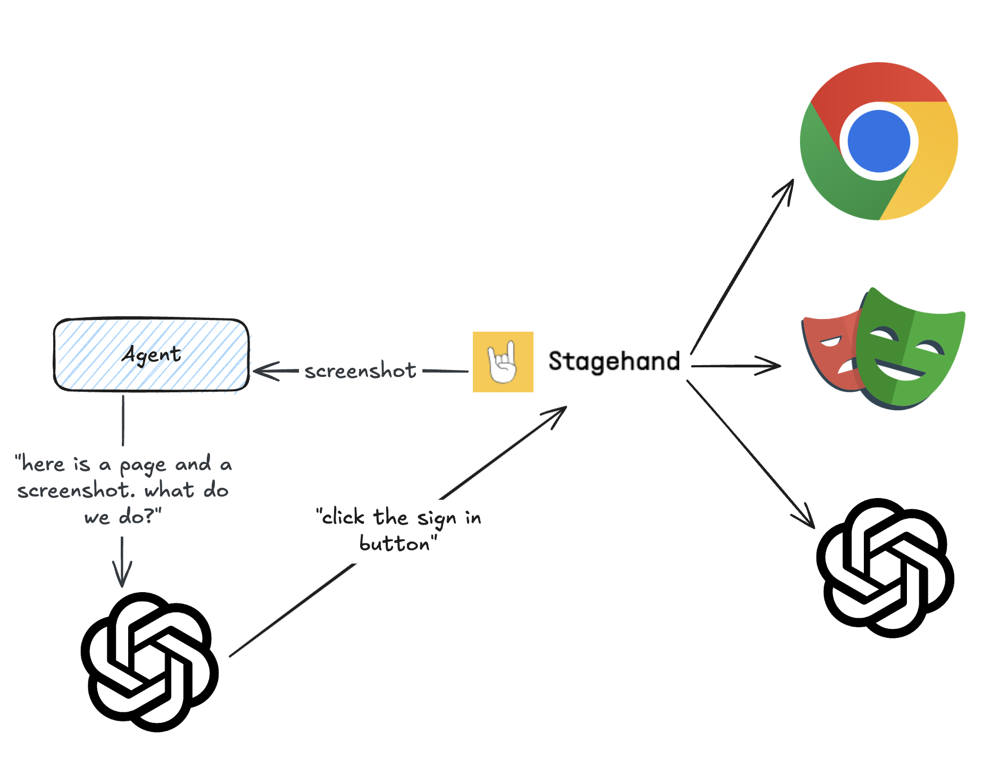

# Open Operator

> [!WARNING]
> This is simply a proof of concept.
> Browserbase aims not to compete with web agents, but rather to provide all the necessary tools for anybody to build their own web agent. We strongly recommend you check out both [Browserbase](https://www.browserbase.com) and our open source project [Stagehand](https://www.stagehand.dev) to build your own web agent.

[](https://vercel.com/new/clone?repository-url=https%3A%2F%2Fgithub.com%2Fbrowserbase%2Fopen-operator&env=OPENAI_API_KEY,BROWSERBASE_API_KEY,BROWSERBASE_PROJECT_ID&envDescription=API%20keys%20needed%20to%20run%20Open%20Operator&envLink=https%3A%2F%2Fgithub.com%2Fbrowserbase%2Fopen-operator%23environment-variables)

# Design & Implementation Plan

## 1. Design System Setup (Phase 1) ✅
- [x] Create `theme.ts` for centralized design tokens
- [x] Update `tailwind.config.ts` with new color palette
- [x] Define typography scale and spacing system
- [x] Create design token documentation

### Color Palette
```typescript
// Primary colors
primary-50: '#f0f9ff'  // Light blue bg
primary-500: '#0ea5e9' // Main blue
primary-700: '#0369a1' // Dark blue

// Neutral colors
neutral-50: '#fafafa'  // Light bg
neutral-200: '#e5e5e5' // Borders
neutral-900: '#171717' // Text
```

### Typography
```typescript
// Font scale
text-xs: '0.75rem'    // 12px
text-sm: '0.875rem'   // 14px
text-base: '1rem'     // 16px
text-lg: '1.125rem'   // 18px
text-xl: '1.25rem'    // 20px
```

## 2. Core Layout Implementation (Phase 2)
- [ ] Update `app/layout.tsx`
- [ ] Implement responsive container system
- [ ] Create base layout components
- [ ] Add Framer Motion providers

### Layout Structure
```typescript
<div className="min-h-screen bg-neutral-50">
  <Header />
  <div className="flex">
    <Sidebar />
    <main className="flex-1">
      <div className="max-w-[1200px] mx-auto">
        {children}
      </div>
    </main>
  </div>
</div>
```

## 3. Component Development (Phase 3)

### Core Components
- [ ] Header Component
  - Navigation
  - User controls
  - Responsive menu
- [ ] Sidebar Component
  - Slide-in animation
  - Navigation links
  - Collapsible sections
- [ ] ChatFeed Component
  - Message threading
  - Loading states
  - Error handling
- [ ] MessageInput Component
  - Rich text support
  - File attachments
  - Send animation

### Utility Components
- [ ] Button System
- [ ] Input Fields
- [ ] Loading States
- [ ] Error Messages
- [ ] Tooltips

## 4. Animation System (Phase 4)
- [ ] Define animation tokens
- [ ] Create reusable animation components
- [ ] Implement page transitions
- [ ] Add micro-interactions

### Example Animation
```typescript
const transitions = {
  slide: {
    initial: { x: -20, opacity: 0 },
    animate: { x: 0, opacity: 1 },
    exit: { x: 20, opacity: 0 }
  }
};
```

## 5. Responsive Design (Phase 5)
- [ ] Define breakpoints
- [ ] Implement mobile navigation
- [ ] Optimize for tablets
- [ ] Test cross-device compatibility

### Breakpoints
```typescript
screens: {
  'sm': '640px',
  'md': '768px',
  'lg': '1024px',
  'xl': '1280px',
  '2xl': '1536px',
}
```

## 6. Performance Optimization (Phase 6)
- [ ] Implement code splitting
- [ ] Optimize image loading
- [ ] Add loading states
- [ ] Monitor performance metrics

## Progress Tracking

### Current Phase: 1 - Design System Setup

### Completed Tasks
- [ ] Initial project setup
- [ ] README documentation
- [ ] Project structure

### Next Steps
1. Begin implementing design system
2. Set up color palette
3. Configure typography

### Notes
- Follow manus.im design patterns
- Maintain minimalist aesthetic
- Focus on smooth animations
- Ensure responsive design
- Document all changes

## Getting Started

First, install the dependencies for this repository. This requires [pnpm](https://pnpm.io/installation#using-other-package-managers).

<!-- This doesn't work with NPM, haven't tested with yarn -->

```bash
pnpm install
```

Next, copy the example environment variables:

```bash
cp .env.example .env.local
```

You'll need to set up your API keys:

1. Get your OpenAI API key from [OpenAI's dashboard](https://platform.openai.com/api-keys)
2. Get your Browserbase API key and project ID from [Browserbase](https://www.browserbase.com)

Update `.env.local` with your API keys:

- `OPENAI_API_KEY`: Your OpenAI API key
- `BROWSERBASE_API_KEY`: Your Browserbase API key
- `BROWSERBASE_PROJECT_ID`: Your Browserbase project ID

Then, run the development server:

<!-- This doesn't work with NPM, haven't tested with yarn -->

```bash
pnpm dev
```

Open [http://localhost:3000](http://localhost:3000) with your browser to see Open Operator in action.

## How It Works

Building a web agent is a complex task. You need to understand the user's intent, convert it into headless browser operations, and execute actions, each of which can be incredibly complex on their own.



Stagehand is a tool that helps you build web agents. It allows you to convert natural language into headless browser operations, execute actions on the browser, and extract results back into structured data.



Under the hood, we have a very simple agent loop that just calls Stagehand to convert the user's intent into headless browser operations, and then calls Browserbase to execute those operations.



Stagehand uses Browserbase to execute actions on the browser, and OpenAI to understand the user's intent.

For more on this, check out the code at [this commit](https://github.com/browserbase/open-operator/blob/6f2fba55b3d271be61819dc11e64b1ada52646ac/index.ts).

### Key Technologies

- **[Browserbase](https://www.browserbase.com)**: Powers the core browser automation and interaction capabilities
- **[Stagehand](https://www.stagehand.dev)**: Handles precise DOM manipulation and state management
- **[Next.js](https://nextjs.org)**: Provides the modern web framework foundation
- **[OpenAI](https://openai.com)**: Enable natural language understanding and decision making

## Contributing

We welcome contributions! Whether it's:

- Adding new features
- Improving documentation
- Reporting bugs
- Suggesting enhancements

Please feel free to open issues and pull requests.

## License

Open Operator is open source software licensed under the MIT license.

## Acknowledgments

This project is inspired by OpenAI's Operator feature and builds upon various open source technologies including Next.js, React, Browserbase, and Stagehand.
